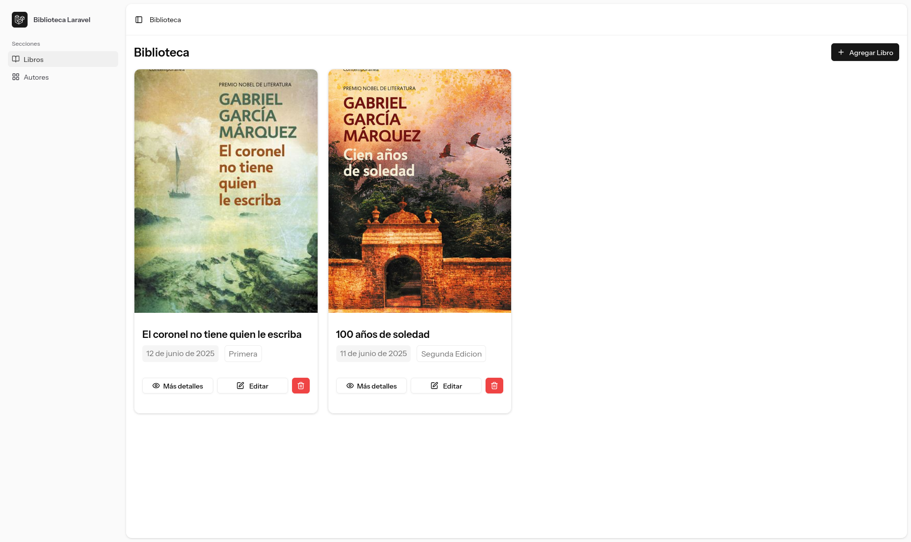
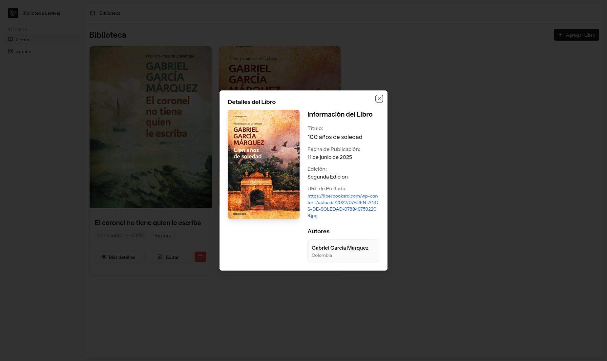
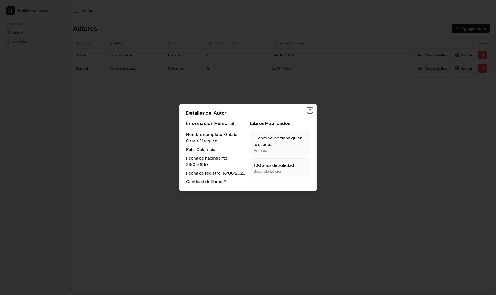
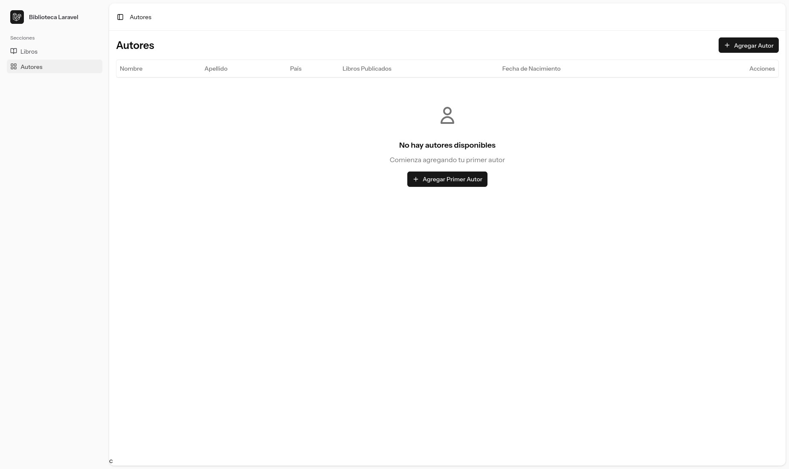

# Lancer Library

Un sistema moderno de gestión de biblioteca construido con Laravel y Vue.js para administrar libros y autores.

## 📸 Capturas de Pantalla

<!-- Placeholder para captura del dashboard principal -->



<!-- Placeholder para captura de gestión de libros -->







## 🚀 Comenzando

### Prerrequisitos

- PHP 8.1 o superior
- Composer
- Node.js 18+ y npm/yarn
- MySQL 5.7+

### Instalación

1. **Clonar el repositorio**

    ```bash
    git clone https://github.com/axl-devhub/Practicas-Tecnica-LancerGroup.git
    cd Practicas-Tecnica-LancerGroup
    ```

2. **Instalar dependencias de PHP**

    ```bash
    composer install
    ```

3. **Instalar dependencias de Node.js**

    ```bash
    npm install
    ```

4. **Configuración del entorno**

    ```bash
    cp .env.example .env
    ```

5. **Configurar la base de datos en `.env`**

    ```env
    DB_CONNECTION=mysql
    DB_HOST=127.0.0.1
    DB_PORT=3306
    DB_DATABASE=lancer_library
    DB_USERNAME=tu_usuario
    DB_PASSWORD=tu_contraseña
    ```

6. **Generar clave de aplicación**

    ```bash
    php artisan key:generate
    ```

7. **Ejecutar migraciones de base de datos**

    ```bash
    php artisan migrate
    ```

8. **Poblar la base de datos (opcional)**

    ```bash
    php artisan db:seed
    ```

9. **Compilar assets del frontend**

    ```bash
    npm run build
    ```

10. **Iniciar el servidor de desarrollo**
    ```bash
    php artisan serve
    ```

La aplicación estará disponible en `http://localhost:8000`

### Desarrollo

Para desarrollo con recarga automática:

```bash
# Terminal 1 - Servidor Laravel
php artisan serve

# Terminal 2 - Servidor Vite
npm run dev
```

## 🎯 Características

- **Gestión de Libros**: Agregar, editar, eliminar y ver libros
- **Gestión de Autores**: Administrar información de autores
- **Relaciones Muchos a Muchos**: Los libros pueden tener múltiples autores
- **Interfaz Moderna**: Construida con Vue.js y Tailwind CSS
- **Diseño Responsivo**: Funciona en escritorio y dispositivos móviles

## 🛠️ Stack Tecnológico

- **Backend**: Laravel 10
- **Frontend**: Vue.js 3 + TypeScript
- **Estilos**: Tailwind CSS
- **Herramienta de Build**: Vite
- **Base de Datos**: MySQL
- **Componentes UI**: Shadcn UI
